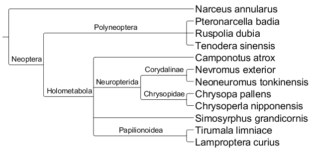
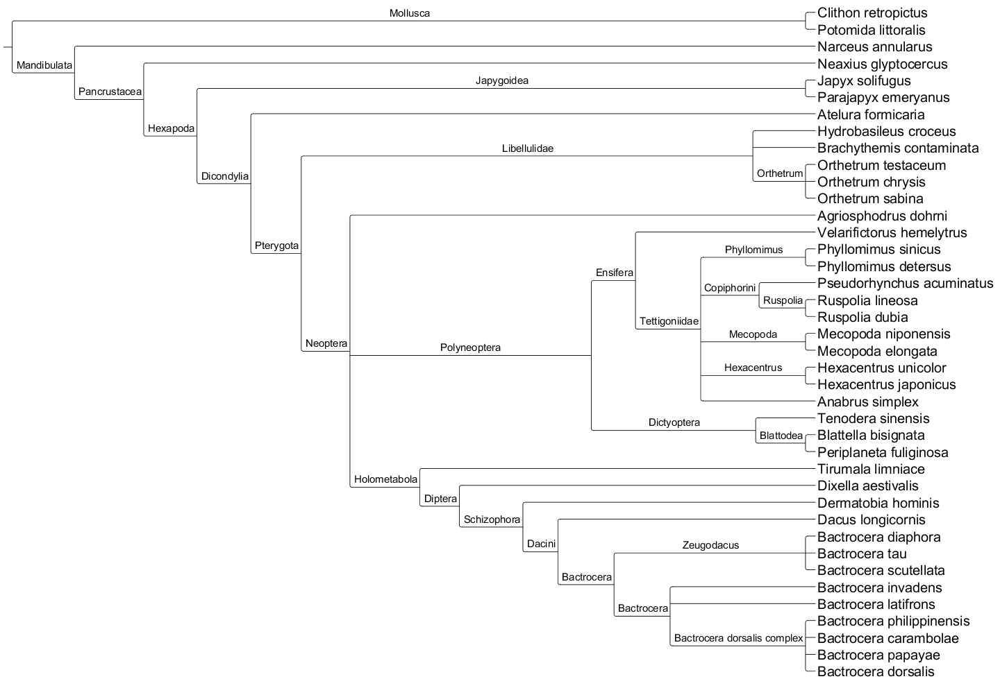

<!-- All of this was written by Christian, except where indicated. !-->


# Introduction <!-- By Jack --!>

The study of biota diversity has been a long-living topic fascinating a number
of investigators in biological science ever since the time of natural history.
Starting from recording the macrofauna and macroflora of an opening ecosystem,
the focus on species recognition has been gradually shifted from the visible
world to the micro ecosystem, the wonderland of microorganism. Unlike studying
the species composition of macrobiota, the invisible nature of microbiota
brings researchers a huge barrier in identifying and recording the composition
of species diversity. The manageable microorganisms have once been the only
group of species that can be identified from the standard protocol like, for
example, isolating and culturing pure clones from a bunch of mixed species to
determine their classification with biochemical analyses; those species that
cannot be cultured then will leave no trace of themselves. Such workflows,
unsurprisingly, depict only a cruel contour of the true picture of species
diversity in microbiota; moreover, cell culturing is a time-consuming step,
which seriously hampers the efficiency of workflow. Consequently, species
identification without cell culturing became the critical point in build an
efficient workflow in studying biodiversity of microbiota.

The emergence of metagenomics, however, solves the problem once and for all.
Metagenomics refers to the study of retrieving and analyzing the genetic
information from environmental samples directly without species identification
in advance. A snapshot of species composition can now be recorded through the
powerful sequencing technology and analyzed by a variety of bioinformatic
tools. A series of software has been published and designed for different
purposes. For example, PHACCS, a bioinformatic tool designed for estimating of
the structure and diversity of uncultured viral communities; QIIME, an
open-source bioinformatics pipeline for performing microbiome analysis
including quality filtering, OTU picking, taxonomic assignment, phylogenetic
reconstruction, and diversity analyses; MLST, a nucleotide sequence based
approach for the unambiguous characterization of isolates of bacteria and other
organisms via defining the distinct pattern of alleles combination in a series
of loci involved in microbial metabolism. With the aid of metagenomics, the
study microbiota has become a popular topics among a number of biological
fields including environmental science, industrial fermentation,
gastrointestinal health, and even mental disorders, showing the amazing linkage
between the fluctuation of microbiota and a great deal of phenomena including
soil fertility, diet preference, metabolomics, and human health. These studies
unveil the hierarchical nature of the biological system, suggesting that the
facts of macroscopic scale are tightly regulated by the composition of
microbiota.

Whether the pipelines of metagenomics provide great help in documenting the
biodiversity of multicellular communities would be a challenging and valuable
trial. With the great success in the study of microbial diversity, metagenomics
has been proved to have great potential in identifying biota diversity directly
from environmental samples. Here, by using a RNA-seq dataset extracted from
a mixed collection of body fragments from several species of arthropod, we
tested the efficiency of two pipelines, based on Basic Local Alignment Search
Tool (BLAST) against all known sequences of NADH dehydrogenase subunit 6 from
NCBI database, with either raw RNA seq or de novo transcripts assembly in
advance, in identifying species composition of the meta-transcriptomic dataset.
Collecting originally from an activity of BioBlitz, the popular field study of
surveying and recording all the living species within a designated area, we
have a complete inventory of the species contributing to the RNA-seq dataset as
a standard in evaluating the efficiency of each of the pipelines.

More than showing the potential of metagenomics in species identifying
biodiversity of arthropods, the workflows built in this study provide great
value in agricultural application. Soil mesofauna, the study of tiny
invertebrates such as mites, nematodes, or spiders that are usually 0.1 mm to
2 mm in length bears a great requirement for establishing the metagenomic
pipelines for species identification directly from environmental samples. The
complex communities of these small creatures, dwelling in soil or in a leaf
cover layer on the soil surface, are hard to be completely covered and analyzed
by traditional workflow based on morphology analyses, and, surprisingly, only
a handful of publications have tried to address such questions with sequencing
technology. Considering the great number of soil-transmitted pests that erode
the total output value of agriculture globally, our work, contributing to
species identification of invertebrates from meta-transcriptomic data, suggests
a possibility of building a pipeline testing the presence of pests from soil
samples. Our study shed light on applying metagenomics to species
identification of invertebrates, providing a possible alternative of pest
control in industrial agriculture.


# Materials and Methods

## RNA-seq Dataset

We use an RNA-seq dataset comprised of material collected from 13 insects and
2 outgroups (a spider and a millipede). It comprises 202,209,951, 100
bases-long, paired-end reads from a RNA-seq Illumina run.

<!-- by Zeb --!>
Order         Family         Genus species                 Common Name
-----         ------         -------------                 -----------
Blattaria     Blattidae      -                             cockroach
Coleoptera    Silphidae      Nicrophorus sp                carrion beetle
Diptera       Syrphidae      -                             hover fly
Hemiptera     Reduviidae     Sinea diadema                 spiny assassin bug
Hymenoptera   Formicidae     Camponotus pennsylvanicus     black carpenter ant queen
Hymenoptera   Vespidae       Polistinae Pollutes fuscatus  northern paper wasp male
Hymenoptera   Vespidae       Eumeninae  Ancistrocerus sp.  mason wasp
Lepidoptera   Papilionidae   Papilio cresphontes           giant swallowtail butterfly
Trichoptera   Phryganeidae   -                             caddisfly
Mantodea      Mantidae       Tenodera sinensis             Chinese mantis
Neuroptera    Chrysopidae    -                             green lacewing
Odonata       Libellulidae   Sympetrum obstrusum           white-faced meadowhawk dragonfly
Orthoptera    Tettigoniidae  -                             katydid
Arachnida     -              -                             spider
Myriapoda     -              -                             millipede

Table: Above are the organisms reportedly sampled in this dataset. There are 13
insects and a spider and millipede inluded as outgroups. '-' represents
a fields that is unknown.


## Mitochondrial dataset <!-- by Zeb --!>

We used the mitochondria currently published in NCBI RefSeq
(ftp://ftp.ncbi.nlm.nih.gov/refseq/release/mitochondrion/). There are 7652
species in total, and the number of species represented in each clade in the table one is represented the Table 2.


clade              total  sequenced
-----              -----  ---------
Phryganeidae       65     1
Reduviidae         878    11
Trichoptera        10100  3
Syrphidae          1524   1
Formicidae         5272   13
Tenodera\_sinensis 1      1
Silphidae          112    1
Myriapoda          1585   15
Tettigoniidae      990    30
Arthropoda         341615 1466
Arachnida          23163  127
Blattidae          108    3
Orthoptera         4337   126
Coleoptera         41773  93
Lepidoptera        93042  211
Papilionidae       721    7
Diptera            52124  145
Hymenoptera        59585  42
Vespidae           442    2
Mantodea           615    8
Mantidae           239    4
Neuroptera         1092   17
Chrysopidae        234    4
Hemiptera          16498  126

Table: Column 1 (total) is a count of the number of species in the NCBI common
tree within the given clade. Column 2 is the number of sequenced
representatives. These numbers were calculated using the `latide` script
(`github.com/arendsee/latide`) and `mitochondrial-stats.sh`.


## Quality check

The quality of the dataset was assessed using the software FastQC (Andrews,
2010) using the following command:

``` sh
fastqc -t 2 -o /ptmp/660_project_bugs/fastqc_output \
    BioBlitz_NoIndex_L008_R1_001.fastq.gz \
    BioBlitz_NoIndex_L008_R2_001.fastq.gz
```

## Pipeline I

First, we obtained the nucleotide sequence for every mitochondrial genome
present into NCBI RefSeq database from
(ftp://ftp.ncbi.nlm.nih.gov/refseq/release/mitochondrion/, specifically the
files “mitochondrion.1.1.genomic.fna.gz” and
“mitochondrion.2.1.genomic.fna.gz”). We then aligned the dataset against this
mitochondrial genomic database using Bowtie2 (Langmead and Salzberg, 2012). For
this we used the following commands:

For concatenate both files

``` sh
cat mitochondrion.*.genomic.fna > mitochondrion.all.fna
```

For building the bowtie2 reference genome index

``` sh
bowtie2-build mitochondrion.all.fna mito_gen
```

For making the alignment

``` sh
bowtie2                                      \
    -p 32                                    \
    --al bugs_unp_al.fastq                   \
    --al-conc bugs_conc_al.fastq             \
    --un bugs_unp_unal.fastq                 \
    --un-conc bugs_nonconc.fastq             \
    -x mitoGen/mito_gen                      \
    -1 BioBlitz_NoIndex_L008_R1_001.fastq.gz \
    -2 BioBlitz_NoIndex_L008_R2_001.fastq.gz \
    -S bugs_vs_mito.sam
```

The --al and --al-conc arguments output the reads that align unpaired and
concordant, respectively, to the database. Whereas the --un and --un-conc
arguments output the reads that have one unaligned pair or both pairs
unaligned, respectively.


We then performed a "de novo" transcript assembly on the concordantly aligned
reads obtained from the Bowtie2 alignment step. This was achieved using Trinity
(Grabherr et al, 2011) with the following command:

``` sh
Trinity                                                \
    --CPU 48                                           \
    --max_memory 10G                                   \
    --seqType fq                                       \
    --left /ptmp/660_project_bugs/bugs_conc_al.1.fastq \
    --right /ptmp/660_project_bugs/bugs_conc_al.2.fastq
```

For the next step, we extracted the aminoacidic sequence of the mitochondrial
protein "NADH dehydrogenase subunit 6" (ND6) for every species in NCBI RefSeq
database (ftp://ftp.ncbi.nlm.nih.gov/refseq/release/mitochondrion/,
specifically from mitochondrion.1.protein.faa.gz and
mitochondrion.2.protein.faa.gz). We then performed a tBLASTn alignment on our
previously “de novo” assembled transcripts versus the ND6 proteins using BLAST+
software (Camacho et al. 2009). For this we used the following commands:

For making the BLAST database

``` sh
makeblastdb                           \
    -in trinity_out_dir/Trinity.fasta \
    -dbtype nucl                      \
    -out blast_trinityDB              \
    -title trinity_out
```

For making the tBLASTn alignment

```
tblastn                                               \
    -task tblastn-fast                                \
    -query nd6_2-mito.faa                             \
    -db /ptmp/BCB660/660_project_bugs/blast_trinityDB \
    -evalue 0.001                                     \
    -num_threads 16                                   \
    -max_target_seqs 1000000000                       \
    -outfmt '7 qseqid sseqid qlen slen
               qstart qstop sstart sstop
               bitscore pident positive evalue' \
    > nd6_2-blast.tab
```

After getting the BLAST results, we used a bash script to re-format the
obtained file for an easier extraction of the required data. This script will
remove the comment lines from the BLAST output and will add a column with the
name of the species for every ND6 protein accession number (see supplementary
materials for scripts).

A summary of the script is provided below (for a full detailed and commented
version, see supplementary materials):

``` sh
join -t $'\t' \
    <( cat $protein_reference                  |
       sed -nr 's/>([^ ]+).*\[(.*)\]/\1\t\2/p' |
       tr ' ' '_' | sort ) \
    <( grep -Pv '^#' $input_blast_result | sort ) \
    > $output_blast_result
```

Once obtained the re-formatted BLAST results, we calculated the most
represented species in the BioBlitz sample using a R script (see supplementary
materials for the commented script). The resulting file is a list of the most
represented species, which was used to generate a phylogenetic tree using NCBI
Common Tree web site
(https://www.ncbi.nlm.nih.gov/Taxonomy/CommonTree/wwwcmt.cgi). Finally, the
obtained tree was visualized using TreeGraph2 software (Stöver and Müller,
2010).

## Pipeline II

For this, we first used the provided reads in the dataset to build a BLAST
database using the following command (for the full script, please refer to
supplementary materials):

For converting the reads from fastq to fasta format

``` sh
zcat $r1 $r2 |
    awk 'NR % 4 == 1 {print ">" $0} NR % 4 == 2 {print}' > $tmpfa
```

For building the BLAST database

``` sh
makeblastdb               \
    -in $tmpfa            \
    -dbtype nucl          \
    -out blastdb/bioblitz \
    -title bioblitz
```

After building the BLAST database we aligned the mitochondrial protein “NADH dehydrogenase subunit 6” (ND6) dataset (the same dataset from pipeline 1) to it using the following command:

``` sh
tblastn                                                      \
   -task tblastn-fast                                        \
   -query nd6_2-mito.faa                                     \
   -db /ptmp/BCB660/arendsee/bcb660-project/blastdb/bioblitz \
   -evalue 0.001                                             \
   -num_threads 16                                           \
   -max_target_seqs 1000000000                               \
   -outfmt '7 qseqid sseqid qlen slen qstart
            qstop sstart sstop bitscore pident
            positive evalue' \
   > nd6_2-blast-all.tab
```

After getting the BLAST results, we performed the same steps as in Pipeline I.
Briefly, used a bash script to re-format the obtained file, calculated the most
represented species in the BioBlitz sample using a R script, generate a
phylogenetic tree using NCBI Common Tree web site and visualized the tree using
TreeGraph2 (as stated before, for a full description of the scripts please
refer to the supplementary materials).


# Results / Discussion

Quality check: The FastQC run reported the following errors: Per base sequence
quality (there was a considerable drop in base call quality at the last bases),
Per base sequence content, Sequence duplication levels and Kmer content (figure
1). Since our project is to identify the different species present in
a BioBlitz sampling, we decided to keep all reads without performing any
trimming or filtering process on them, regardless of the quality check results.


Pipeline I: From the downloaded RefSeq mitochondrion database we used all of
7,809 available genome sequences to build our Bowtie2 reference index. The
Bowtie2 alignment gave us a total of 8,949,517 paired reads that aligned
concordant to our mitochondrial genomes database (roughly 4.4% of the total
reads). The Trinity “de novo” assembly on these files predicted 534
transcripts. These transcripts were used as the database for our BLAST search
which gave us a total of 7,486 hits. Using tBLASTn alignment score and results
filtering, we could indicate how many times a certain species' ND6 protein had
a maximum score hit for any different predicted transcript. We used these
results to suggest this species' RNA abundance in out BioBlitz sample. From
this data, we obtain that 12 species were likely to be present. Every species
was represented either 1 or 2 times at most. The exception was one species,
represented 25 times (the butterfly Tirumala limniace, table 1 and figure 2).


Species Name             Max-score hits count
------------             --------------------
Camponotus atrox         2
Chrysopa pallens         1
Chrysoperla nipponensis  1
Lamproptera curius       1
Narceus annularus        1
Neoneuromus tonkinensis  1
Nevromus exterior        1
Pteronarcella badia      1
Ruspolia dubia           1
Simosyrphus grandicornis 2
Tenodera sinensis        1
Tirumala limniace        25

Table: List of species present according to results from Pipeline I





## Pipeline II

We performed a tBLASTn using the entire 202,209,951 BioBlitz dataset read pairs
as our database and all of the 7,418 ND6 protein sequences available on NCBI
RefSeq as our query. The BLAST alignment produced 4,646,398 total hits. Again,
using tBLASTn alignment score and results filtering, we could indicate how many
times a certain species' ND6 protein had a maximum score hit for any different
read of our BioBlitz dataset. We used these results to suggest this species'
RNA abundance in our sample. From this processing, we obtained a total of 214
species with a maximum-score hit. In order to narrow down our results, we
applied an extra filter for extracting only those species with a number of
maximum hits above a defined threshold.  Table 2 shows the different selected
threshold values and the number of species obtained. We could observe that
setting our max-score hits threshold above 30 showed little effect on the
number of species extracted. Nevertheless, we decided to use 200 max-score hits
as threshold value to narrow as much as we can our output. Figure 3 shows the
obtained tree.

Number of max-score hit threshold Number of species
--------------------------------- -----------------
0                                 214
10                                78
20                                61
30                                52
40                                49
50                                49
60                                47
70                                46
100                               40
200                               33

Table: Number of species showing different max-score hit thresholds

Figure 3. Phylogenetic tree obtained from Pipeline II (Right) and the different
sub-categories present, according to NCBI taxonomy web site (Lower-left). 




## Comparison to expected species  <!-- Zeb's --!>

All analysis to this point has assumed nothing was known about the sample that
was sequenced. This, of course, is not true, since the researchers sampled
specific organisms (see Table 1). Of the species listed in Table 1, only
*Tenodera sinensis* has a mitochondria that has been sequenced. As expected,
this species is identified exactly by both pipelines. A sister species of
*Componatus pennsylvanica*, *Componatus atrox*, is found. The spider seems to
be missing from our sample, strangely (though there are plenty of spider
mitochondria in our dataset).

# Conclusions

Here, we assessed two different methods for stablishing the number and type of
species in a BioBlitz sampling. The first method relied on a more conservative
pipeline, using “flagship” next generation sequencing analysis software such as
Bowtie2 and Trinity. The second method involved a very simplified, yet elegant,
pipeline using BLAST and locally-made scripts (bash and R scripts). Each method
provided enough data to suggest a list of species present however we can
appreciate the following differences/limitations: while the pipeline I gave us
much less species (we only obtain 12 species compared to the 214 obtained with
pipeline II) it seems to be very accurate on the number and type of species. On
the other hand, our pipeline II needed an extra filtering step. However, having
a high number of species on pipeline II can give us much more flexibility for
performing further analysis that we may want (such as determining non-insect
species presence our sampling). As for required time and resources, both
pipelines performed very similar, running the entire pipeline in about 2 days
on the hpc cluster.

From these results, we only can conclude that both pipelines are useful for
identifying the present species on a BioBlitz sampling. Whether you choose to
use one or the other pipeline may depend on software availability and the
research question, among other issues related to the experiment being
conducted.

Our results seem to closely match the expected results, although finer-grained
taxonomic analysis and sequence similarity analysis is needed. It would be
interesting to compare the results of our very simple analysis to those of
standard methods (e.g. QIIME).


# Author's Contribution

Zebulun Arendsee wrote the scripts for taxonomic analysis and blast. Ang-Yu Liu
performed BUSCO analyses (though we did not include these results, they
represented a great deal of work) and also performed exhaustive literature
review. Christian Montes performed the fastqc, trinity, bowtie analyses, and
ran and analyzed scripts from ZA. All of the authors contributed to the design
and writing of this project.

# References

Andrews S. (2010). FastQC: a quality control tool for high throughput sequence data. Available online at: http://www.bioinformatics.babraham.ac.uk/projects/fastqc

Camacho, C., Coulouris, G., Avagyan, V., Ma, N., Papadopoulos, J., Bealer, K. and Madden, T.L., 2009. BLAST+: architecture and applications. BMC bioinformatics, 10(1), p.421.

Grabherr, M.G., Haas, B.J., Yassour, M., Levin, J.Z., Thompson, D.A., Amit, I., Adiconis, X., Fan, L., Raychowdhury, R., Zeng, Q. and Chen, Z., 2011. Trinity: reconstructing a full-length transcriptome without a genome from RNA-Seq data. Nature biotechnology, 29(7), p.644.

Langmead, B. and Salzberg, S.L., 2012. Fast gapped-read alignment with Bowtie 2. Nature methods, 9(4), pp.357-359.

Stöver, B.C. and Müller, K.F., 2010. TreeGraph 2: combining and visualizing evidence from different phylogenetic analyses. BMC bioinformatics, 11(1), p.7.

# Scripts

Most scripts are available on `github.com/arendsee/bcb660-project`. These
scripts were wrapped for slurm submission with the `autoslurm.sh` script (not
included, but on github).


Scripts used:

 1. Get mitochondrial genomes

``` sh
# Retrieve mitochondrial genomes
# If they are already downloaded, do nothing

outdir=data_mitochondria

if    [[ ! -d $outdir ]]
then
    mkdir $outdir
    wget \
    -P $outdir -nd -r -A gz \
    ftp://ftp.ncbi.nlm.nih.gov/refseq/release/mitochondrion
    cd $outdir
    gunzip *gz
fi
```

 2. Build a BLAST database

```
module load ncbi-blast

[[ -d blastdb/ ]] || mkdir blastdb

r1=/ptmp/bioblitz/BioBlitz_NoIndex_L008_R1_001.fastq.gz
r2=/ptmp/bioblitz/BioBlitz_NoIndex_L008_R2_001.fastq.gz

# Check existence of the input files, die if missing
[[ -f $r1 && -f $r2 ]] || ( echo "Cannot open fastq files: $r1 $r2" >&2 && exit 1 ) 

tmpfa=fastq-fasta-extract_DELETEME.fa

# If z.fa already exists, and isn't an empty file, don't remake it
if [[ ! -s $tmpfa ]]
    then
    # Extract and combine the fasta sequences from the two fastq files
    # NOTE: I am not doing any cleaning or trimming here
    zcat $r1 $r2 |
    awk  'NR % 4 == 1 {print ">" $0} NR % 4 == 2 {print}' > $tmpfa
fi

if [[ ! -d blastdb ]]
then
    # Make the blast database, to access it with blast, use a command of the form:
    # $ blastp -db /blastdb/bioblitz -query whatever.faa [options]
    makeblastdb -in $tmpfa -dbtype nucl -out blastdb/bioblitz -title bioblitz
    echo "making a db" > &2
    else
    echo "not making a db, already exists" > &2
fi

# If makeblastdb fails, 
if [[ $? -eq 0 ]]
    then
    rm $tmpfa
    exit 0
else
    echo "makeblastdb run failed" >&2
    exit 1
fi
```

 3. run the tBLASTn alignment

``` sh
module load python/3.6.0
module load ncbi-blast

[[ -d smof ]] || git clone https://github.com/arendsee/smof

all_pro='data_mitochondria/mitochondrion*protein.faa'

base=nd6_2
protein_name="NADH dehydrogenase subunit 6";

blastresult=${base}-blast.tab
my_pro=data_mitochondria/${base}-mito.faa

cat $all_pro | smof/smof.py grep "$protein_name" > $my_pro

tblastn                     \
-task tblastn-fast          \
-query $my_pro              \
-db blastdb/bioblitz        \
-evalue 0.001               \
-num_threads 8              \
-max_target_seqs 1000000000 \
-outfmt '7 qseqid sseqid qlen slen qstart qstop sstart sstop bitscore pident positive evalue' > $blastresult
```

 4. Re-formatting BLAST output (getting species names)

```
#!/usr/bin/bash

set -u

# USAGE:
#   # assuming you are running this from the bcb660-project folder:
#   scripts/autoslurm.sh scripts/add-names-to-blast-result.sh nd6-blast.tab

# This should be the name of the output file from BLAST, e.g. nd6-blast.tab
# 1. The file may have comments inside
# 2. The file is expected to have the extension `.tab`
input_blast_result=$1

# --- You shouldn't need to change this
# The protein fasta files are used just to extract the map between reference
# and species name. The fasta headers are assumed to have the format:
# >REFERENCE ... [ SPECIES_NAME ]
protein_reference=data_mitochondria/mitochond*protein.faa

# This is the name of the output file, the parameter expansion below replaces
# the extension on the input.
output_blast_result=${input_blast_result/.tab/-with-names.tab}

# Extract a reference to name map from the protein sequence file
# Join the map table with the blast result table
#  1. This adds the scientific species names as the second column in the output file
#  2. Replaces space in the species name with underscores
#  3. This will remove all comments from the blast result file 


join -t $'\t' \
<( cat $protein_reference                   |
sed -nr 's/>([^ ]+).*\[(.*)\]/\1\t\2/p' |
tr ' ' '_' | sort ) \
<( grep -Pv '^#' $input_blast_result | sort ) > $output_blast_result
```

    5. R script for extracting the most represented species 

``` R
require(readr)
require(dplyr)
require(magrittr)

# Provide the name for the re-formatted BLAST output
blastfile <- 'nd6-blast-with-names.tab'

d <- read_tsv(blastfile, col_names=FALSE, comment="#") %>%
select(X2,X3,X8) %>%
rename(species=X2,read=X3,bitscore=X8)
d$species <- gsub("_", " ", d$species)

# total number of species
(total <- length(unique(d$species)))

# species list (you can plug this into NCBI common tree)
write(unique(d$species), file="species-with-hits.txt")


# Get just the matches that are maximum for each read
d <- group_by(d, read) %>% dplyr::filter(bitscore == max(bitscore))

# number of species with maximum against at least one read
(withmax <- length(unique(d$species)))

(counts <- summary(factor(d$species), maxsum=Inf))
write(unique(d$species), file="species-with-a-max-hit.txt")

hist(log(counts))

# modify this to get the list of species with more than N max-score hits
names(counts[counts > 200]) %>%
write(file="species-with-more-than-200-max-hits.txt")
```

 6. `mitochondrial-stats.sh` - Clade membership analysis

``` sh
set -u

mitodir=data_mitochondria
sample=sample-taxonomies.tab

statdir=mito-stats

[ -d $statdir ] || mkdir $statdir

species_list=$statdir/species-list.txt
gene_counts=$statdir/gene-counts.tab
irregular_names=$statdir/irregular-names.tab
mitorep=$statdir/mitochondria-report.txt

mitoclades=$statdir/mito-clade-counts.tab

mitoprot=$mitodir/*protein*faa

list-species () {
    sed -nr 's/^>.*\[(.*)\]$/\1/p' $mitoprot |
        uniq | sort -u
}

count-genes () {
    echo -e "count\tn_proteins"
    sed -nr 's/^>.*\[(.*)\]$/\1/p' $mitoprot |
        sort | uniq -c |
        awk '{print $1}' |
        sort -n | uniq -c | sort -rn |
        sed 's/^ *//; s/  */\t/'
}

list-irregular-species-names () {
    grep -vP '^[A-Z][a-z]+ [a-z]+$' $species_list | sed 's/^/  /'
}

make-report () {
    echo -n "Number of represented mitochondrial genomes: "
    wc -l $species_list | sed 's/ .*//'

    echo
    echo "First 10 most common mitochondrial gene counts"
    head -11 $gene_counts

    echo
    echo "Species with irregular names (i.e. not '[A-Z][a-z]+ [a-z]+'):"
    wc -l $irregular_names | sed 's/ .*//'
}

[ -f $species_list    ] || list-species                 > $species_list
[ -f $irregular_names ] || list-irregular-species-names > $irregular_names
[ -f $gene_counts     ] || count-genes                  > $gene_counts
[ -f $mitorep         ] || make-report                  > $mitorep


# ==================== T A X O N O M I C   R E P O R T ========================

if [ ! -d litade ]
then
    git clone https://github.com/arendsee/litade
    cd litade
    ./setup.sh
    cd ..
fi
litade=$PWD/litade/litade.pl

if [ ! -f taxid2sciname.tab ]
then
    wget -O taxdmp.zip ftp://ftp.ncbi.nih.gov/pub/taxonomy/taxdmp.zip
    unzip -p taxdmp.zip names.dmp > names.dmp
    # Build a map from Taxon Id to Scientific name
    sed 's/[\t ]*|[\t ]*/\t/g' names.dmp |
        awk '
            BEGIN{FS="\t"; OFS="\t"}
            /scientific name/ {print $1,$2}
        ' > taxid2sciname.tab
fi

sample_taxids="inputs/sample-taxids.tab" 
mito_taxids=mito-taxids.txt
protein_gpff=$mitodir/*protein*gpff

join -t $'\t' \
     <(sort $sample_taxids) \
     <($litade $(cut -f 1 $sample_taxids) | sort) |
    tee z |
    awk 'BEGIN{FS="\t"; OFS="\t"} {print $1,$2}' | sort | uniq -c |
    sed 's/  *//' | sed 's/ /\t/' | 
    awk 'BEGIN{FS="\t"; OFS="\t"} {print $2,$3,$1}' | sort > a

join -1 1 -2 3 -t $'\t' \
     <(sed -nr 's/.*db_xref="taxon:([0-9]+).*/\1/p' $protein_gpff | sort -u) \
     <(sort -t $'\t' -k3 z) |
    cut -f2 | sort | uniq -c |
    awk 'BEGIN{OFS="\t"} {print $2,$1}' > b


echo -e "taxid\tclade\ttotal\tsequenced" > $statdir/taxid-counts.tab
join -t $'\t' <(sort a) <(sort b) >> $statdir/taxid-counts.tab

rm a b z
```
